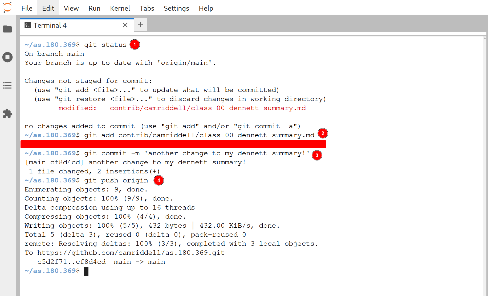
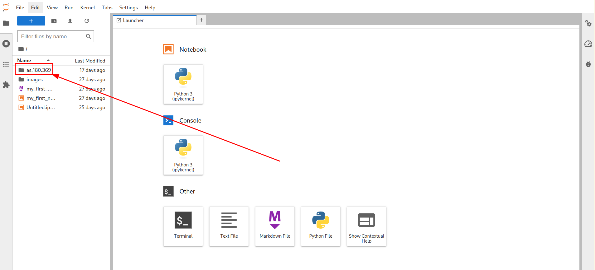
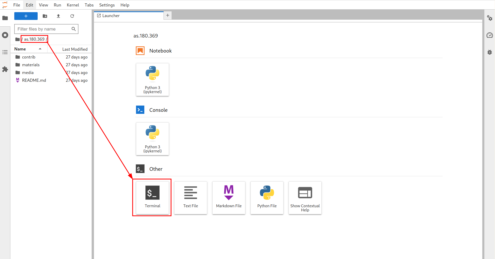
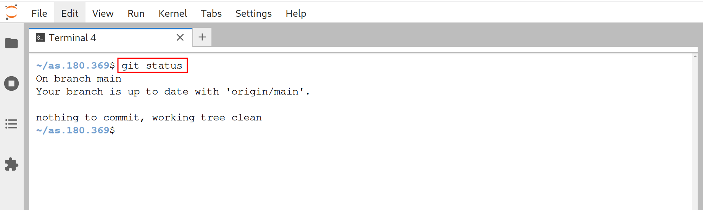
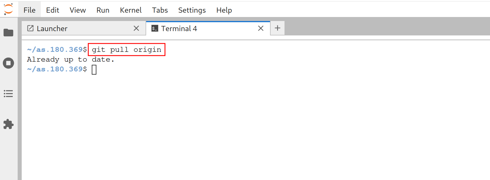
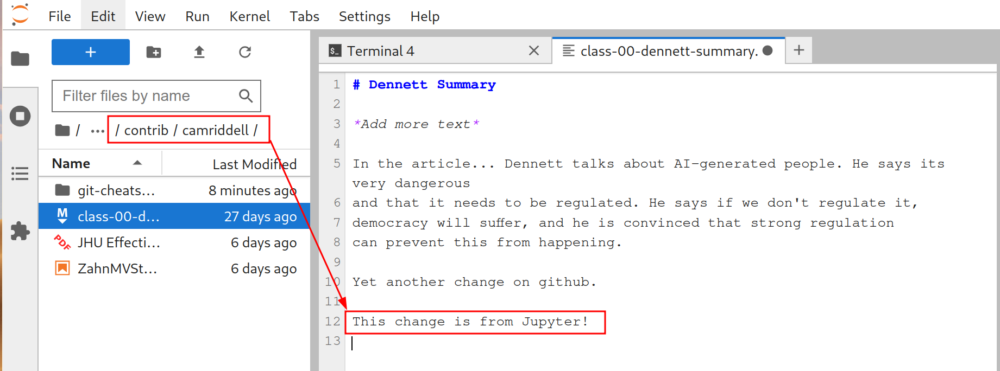
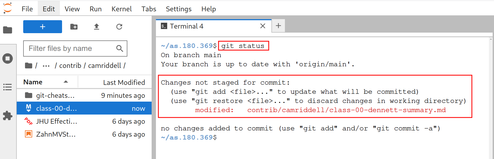
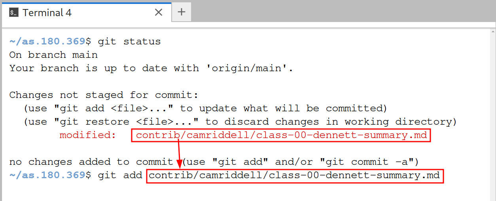
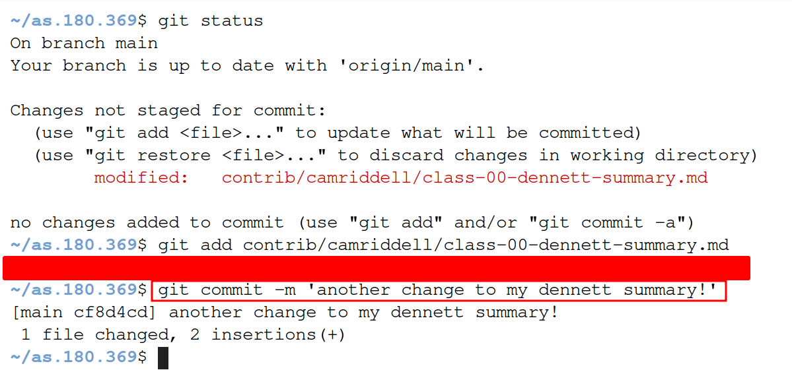

# Git Cheatsheet

## The Workflow - Overview



1. `git status` to check your git repository for any files that have changed.
2. `git add` the changes you want to include in your commit/checkpoint
3. `git commit` to commit/save/checkpoint all of the file changes you `git add`ed.
4. `git push origin` to synchronize your changes from jupyterhub → github!

## The Workflow - Detailed

1. Sign into Jupyterhub and double click on your **as.180.369** folder.



2. Open a terminal session using the Launcher Button.



3. Check your git repository for any unsaved edits from previous work.



**Note**: If there were unsaved edits, feel free to continue making edits until you are ready to commit/checkpoint them.

4. Retrive your most recent edits on Github!



5. Make some edits to your file(s)



6. Check for those change(s) using `git`



7. Add your edit(s) to be a part of the next commit



8. Commit your `add`ed changes!



9. Synchornize all the changes you made on Jupyterhub to Github


## FAQ

- **I used `git commit` and then got stuck in some odd window!**
Stuck in a window like this? It is likely that you forgot to use the `-m` flag on your `git commit` command. To quit out of this window, the window will tell you to use the `^X` key where this directly corresponds to holding the control key on your keyboard and hitting "X": `<ctrl> + X` this will quit out of that window and let you attempt your commit again.

- **I made changes on Github, why are they not on Jupyterlab?**
*You need to synchnize the changes from Github to Jupyter. Log into your Jupyterhub and start a terminal session in your `as.180.369` folder. Once you have done that, use this command to grab the most recent changes from github:

```
git pull origin
```
